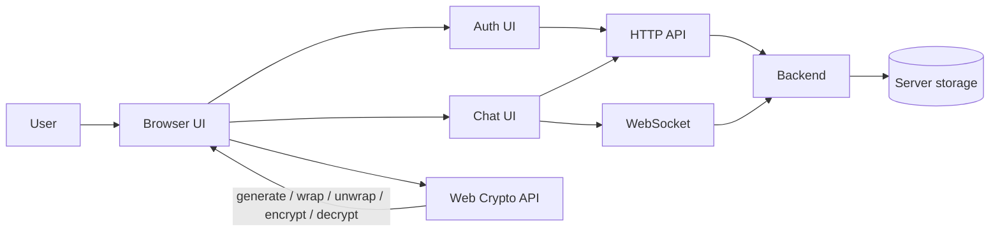

# WhisperBox

WhisperBox is a browser-based encrypted chat app. The client handles authentication, key generation, message encryption and decryption, while the server provides account, conversation, and transport APIs.

## Architecture



### Main client modules

- `src/app.js` wires the application together and coordinates login, logout, conversation loading, and websocket startup.
- `src/features/auth/auth.js` handles register/login and manages key generation and private-key recovery.
- `src/features/chat/chat.js` and `src/features/chat/chat.ui.js` handle message loading, rendering, sending, and decryption failures.
- `src/core/crypto.js` contains all Web Crypto helpers.
- `src/core/store.js` holds the current session state in memory.
- `src/services/api.js` talks to the backend over HTTP.
- `src/services/websocket.js` handles live message delivery and presence updates.
- `src/utils/ui.js` provides shared UI helpers such as loading, errors, and toast notifications.

## Encryption Flow

### Registration

1. The client generates an RSA-OAEP key pair in the browser.
2. The user password is turned into a wrapping key with PBKDF2.
3. The private key is wrapped before being sent to the server.
4. The public key, wrapped private key, and PBKDF2 salt are stored server-side with the account.

### Login

1. The client logs in with username and password.
2. The app fetches the user profile and obtains the stored public key, wrapped private key, and salt.
3. The password is used to derive the wrapping key again.
4. The wrapped private key is unwrapped in the browser and kept in memory for the current session.
5. The public key is imported into a CryptoKey for outgoing encryption.

### Sending a message

1. The client fetches the recipient's public key.
2. A fresh AES-GCM key is generated for the message.
3. The plaintext message is encrypted with the AES key.
4. The AES key is encrypted twice with RSA-OAEP:
   - once for the recipient
   - once for the sender's own copy
5. The encrypted payload is sent over WebSocket when possible, or HTTP as a fallback.

### Reading a message

1. The client selects the right encrypted AES key field based on whether the message is self-sent.
2. The AES key is decrypted with the user's private key.
3. The message ciphertext is decrypted with AES-GCM.
4. If decryption fails, the UI shows a failed message bubble and a toast warning.

## Key Management

- The RSA key pair is generated in the browser.
- The public key is exported in SPKI format and stored on the server.
- The private key is never stored in plaintext.
- The private key is wrapped with a password-derived key before being persisted.
- The password-derived wrapping key uses PBKDF2 with SHA-256 and 100,000 iterations.
- A per-user salt is generated during registration and stored with the account.
- Legacy private-key payloads are still supported through a fallback unwrap path.
- Keys are kept in memory only for the active session and are cleared when the store is reset.

## Security Trade-offs

- The app is end-to-end encrypted at the message layer, but the browser still holds the decrypted private key during the active session.
- Message metadata such as sender, recipient, timestamps, and delivery timing is not hidden from the server.
- The server can still observe account activity, conversation relationships, and message transport patterns.
- Password-based key recovery depends on the strength of the user's password.
- The application uses RSA-OAEP for key wrapping and AES-GCM for message content, which is practical for this scale but not a full ratcheting protocol.
- If the browser session is compromised, the in-memory key material can be exposed.
- WebSocket delivery improves responsiveness, but the HTTP fallback means transport confidentiality still depends on the underlying HTTPS channel.

## Known Limitations

- This is not a Signal-style double-ratchet system.
- There is no perfect forward secrecy per message beyond the AES-GCM message key lifecycle.
- There is no key verification or safety-number workflow.
- Group messaging is not implemented.
- Attachments are not implemented.
- Search, presence, and conversation metadata are not end-to-end encrypted.
- Decryption failures can happen for legacy payloads, stale keys, or corrupted data; the UI now shows a failed bubble and a toast.
- The app stores session state in memory only, so refreshes or tab closes clear active keys and conversation state.

## Project Layout

```text
index.html
style.css
src/
  app.js
  core/
    constants.js
    crypto.js
    store.js
  features/
    auth/
      auth.js
      auth.ui.js
    chat/
      chat.js
      chat.ui.js
      conversations.js
  services/
    api.js
    websocket.js
  utils/
    avatar.js
    format.js
    ui.js
```

## Notes

- The app keeps the UI lightweight and relies on the browser's Web Crypto API for all cryptographic operations.
- Toasts and loading states are handled in the UI layer so cryptographic code stays focused on encryption and decryption.